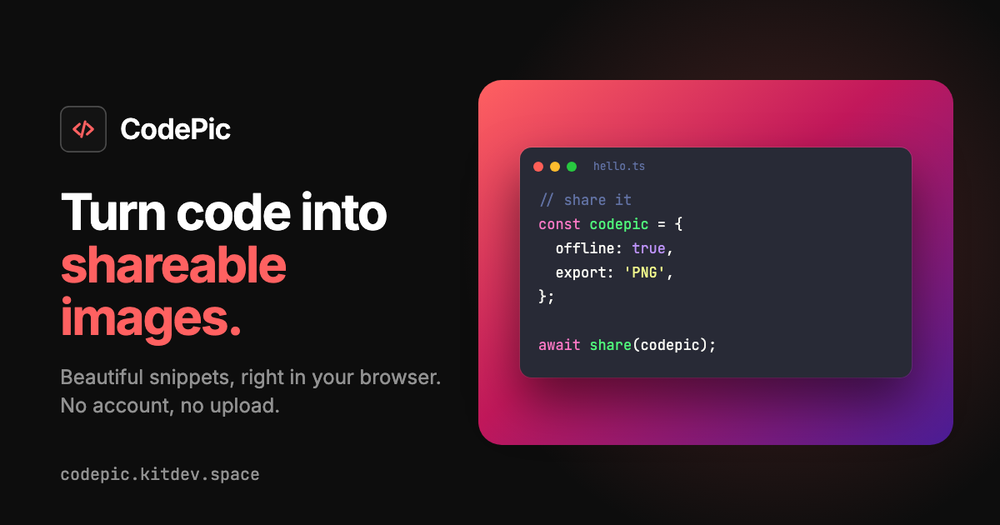

<p align="center">
  
</p>

<h1 align="center">CodePic</h1>

<p align="center">
  Your code deserves a better screenshot.<br>
  Paste it, style it, share it. Nothing ever leaves your browser.
</p>

<p align="center">
  <a href="https://codepic.kitdev.space/"><strong>Open CodePic</strong></a>
</p>

<p align="center">
  
</p>

Most code screenshots are a crop of someone's editor: a stray sidebar, a blinking cursor, colors that looked fine in dark mode and terrible on a white slide. CodePic gives you the opposite. You paste a snippet, pick a look, and get a clean image you can drop into a post, a slide, or a pull request.

It's free, it has no accounts, and it has no server. The highlighting, the layout and the export all happen on your machine.

## What makes it different

**It's private.** Your code never gets uploaded, stored, or logged. There's no backend to send it to. The only thing kept between visits is how the card looks, and never what's in it.

**It works without a connection.** Visit once and CodePic loads and exports offline. You can install it like an app, too.

**It points at what matters.** Click a line number to highlight it, and the rest of the code fades back. Click again to mark a line as added or removed, and you get a diff view with `+` and `−` in the gutter.

**Other tools can drive it.** Every setting can be filled in from a link, and a small command line tool draws the same image without opening a browser. Docs sites, scripts and editors can use CodePic as a building block.

## A quick tour

1. **Paste your code.** CodePic guesses the language, and tells you it did, so you can change it in one click. If it isn't sure, it falls back to plain text and doesn't guess wrong.
2. **Make it yours.** The settings sidebar groups appearance, code, layout and export controls. Pick a background and theme, search for a language, adjust padding and width, or change the window and line numbers. On smaller screens, **Customize image** opens the same controls in a settings sheet.
3. **Get the image.** Download a PNG or an SVG, copy the image to your clipboard, or copy a link that opens the exact same snapshot. Drag the handles on the sides of the card to set the width.

### Keep a look you like

Presets remember a whole appearance under a name. Start from one of the five built in (Default, Clean light, Midnight, Terminal and Sunset), or save your own. They live in your browser, they never contain your code, and you can export them as a small file to move to another machine.

### Share a snapshot

The share link packs your code and settings into the URL itself, compressed in the browser, so long snippets fit and there's still no server involved. A small meter next to the button shows up as you get close to the size limit. If a snippet is too big for a link, the app says so and leaves the code out instead of failing quietly.

### Stay on the keyboard

Every shortcut uses Ctrl (⌘ on macOS), so nothing fires while you're typing. The keyboard button in the footer lists them too.

| Action              | Shortcut               |
| ------------------- | ---------------------- |
| Download image      | Ctrl/⌘ + Enter         |
| Copy image          | Ctrl/⌘ + Shift + Enter |
| Copy share link     | Ctrl/⌘ + Shift + L     |
| Open image settings | Ctrl/⌘ + .             |
| Focus the editor    | Ctrl/⌘ + Shift + E     |
| Show shortcuts      | Ctrl/⌘ + /             |

## Use it from other places

### Open it with a link

Any page or tool can open CodePic with code and options already filled in. The link is read in the browser and nothing is sent anywhere.

```
https://codepic.kitdev.space/?theme=nord&lang=python&code=print(%22hi%22)
```

If you write docs or a blog, a plain link is the easiest way to let readers tweak a snippet themselves:

```html
<a href="https://codepic.kitdev.space/?theme=nord&amp;lang=python&amp;code=print(%22hi%22)">
  Open in CodePic
</a>
```

| Parameter   | Values                                                                                                             |
| ----------- | ------------------------------------------------------------------------------------------------------------------ |
| `code`      | The snippet, URL-encoded. Up to 8,000 characters                                                                   |
| `lang`      | A language id, such as `typescript`, `python`, `shell`                                                             |
| `theme`     | `github-light`, `github-dark`, `dracula`, `nord`, `one-dark-pro`                                                   |
| `bg`        | A background preset (`ocean`, `slate`, `sunset`, `forest`, `paper`, `charcoal`, `violet`, `rose`) or `transparent` |
| `padding`   | `16`, `32`, `64` or `128`                                                                                          |
| `width`     | `320` to `1600`                                                                                                    |
| `font`      | `12`, `14`, `15`, `16`, `18`, `20` or `24`                                                                         |
| `lh`        | Line height, `1.2` to `2`                                                                                          |
| `window`    | `controls`, `minimal` or `borderless`                                                                              |
| `lines`     | Line numbers: `true`, `false`, `1` or `0`                                                                          |
| `wrap`      | Wrap long lines, same values                                                                                       |
| `showTitle` | Show the filename, same values                                                                                     |
| `title`     | The filename, up to 200 characters                                                                                 |
| `scale`     | PNG scale: `1`, `2` or `3`                                                                                         |
| `format`    | Download format: `png` or `svg`                                                                                    |
| `highlight` | Lines to emphasize, such as `2,5-7`                                                                                |
| `added`     | Lines marked as added                                                                                              |
| `removed`   | Lines marked as removed                                                                                            |

Unknown parameters are ignored. A value that isn't allowed is skipped and the page tells you, and the rest still apply. Nothing in a link ever runs as code.

When sources disagree, the first of these wins: a share link (`#z=`), then URL parameters, then your saved settings, then the defaults.

You can also frame the whole app in a page if you want to:

```html
<iframe
  title="CodePic"
  src="https://codepic.kitdev.space/?theme=nord&amp;lang=python&amp;code=print(%22hi%22)"
  width="100%"
  height="560"
  loading="lazy"
  sandbox="allow-scripts allow-same-origin"
></iframe>
```

The frame shows the whole app, not a small viewer. CodePic sends nothing to the host page, and the site's analytics script loads inside the frame as well. A host with a strict content security policy has to allow `codepic.kitdev.space` as a frame source. This hasn't been tried on specific hosts.

### From the command line

```sh
npx codepic --file app.ts --theme nord -o out.png
cat app.ts | npx codepic --lang typescript -o out.svg
```

Code comes from `--file` or standard input. `-o` sets the output path, and a `.svg` name writes SVG. The language is guessed when you don't pass `--lang`, and the filename comes from `--file`. Every parameter in the table above works as an option with the same name and values, for example `--theme nord --highlight 2,5-7`. Run `codepic --help` for the full list. Mistakes name the option and the values it accepts, and exit with status 1.

It uses the same highlighter, themes and layout numbers as the app, so the images match closely. Two differences to know about: the drop shadow is an approximation, and text wraps by character count, so wide characters like CJK or emoji can overrun a row. Nothing is uploaded.

## What you can change

| Setting     | Options                                                                                                    |
| ----------- | ---------------------------------------------------------------------------------------------------------- |
| Themes      | GitHub Light, GitHub Dark, Dracula, Nord, One Dark Pro                                                     |
| Backgrounds | Six gradients, two solids, or transparent                                                                  |
| Languages   | JavaScript, TypeScript, HTML, CSS, JSON, Shell, Python, Go, PHP, SQL, Java, C#, Rust, Markdown, plain text |
| Size        | Width 320–1600px, padding 16/32/64/128, export at 1×, 2× or 3×                                             |
| Export      | PNG, or SVG with the text kept as text and the code font embedded                                          |
| Window      | Traffic-light controls, minimal, or borderless, each with an optional filename                             |

The theme colors the code and the background sits behind the card. They're independent, so changing one never disturbs the other.

## Privacy, plainly

- Your code isn't sent anywhere. There's no server to receive it.
- Your code isn't saved. Only appearance settings and presets go to `localStorage`.
- Links carry everything in the URL, so anyone with the link can read the code in it. Keep secrets out of snippets you share.
- The hosted site loads an [Umami](https://umami.is) script from the maintainer's own analytics server, for page statistics.

## Run it yourself

You need Node 22 or newer and [pnpm](https://pnpm.io).

```sh
vp i
vpr dev
```

Then `vpr check` runs formatting, linting and types, `vpr test` runs the unit tests, and `vpr build` writes the site to `dist/`. CI runs the same checks on every push and pull request, and publishes to GitHub Pages when `main` is green.

To try the command line tool from a checkout, run `vpr run cli:build` and then `node packages/cli/dist/cli.js --help`.

## Under the hood

```
src/
  styles/tokens.css      design tokens: color, spacing, radius, type
  components/ui/         Bits UI wrappers: Button, Select, Dialog, Switch, …
  components/toolbar/    settings inspector, mobile sheet and preset manager
  components/preview/    the code card, resize handles, export frame
  lib/config/            appearance settings, themes, languages, backgrounds
  lib/persistence/       saved settings in localStorage
  lib/highlight/         Shiki, line splitting, language detection
  lib/marks/             line highlight and diff marks
  lib/export/            PNG and SVG capture, copy, download
  lib/share/             share links, URL parameters, startup
  lib/presets/           saved and built-in looks
  lib/shortcuts/         keyboard shortcuts
packages/cli/            the command line tool
```

One `AppearanceConfig` object drives the whole snapshot. Code is kept apart from it, so saving and sharing can treat the two differently.

The preview and the exported image render from the same `CodeWindow` component, so what you see is what you get. The export copy sits off-screen at the exact configured width, which means the image matches your settings and not whatever size the preview happens to be scaled to.

Highlighting is [Shiki](https://shiki.style) running in the browser, and the PNG and SVG come from [modern-screenshot](https://github.com/qq15725/modern-screenshot). Editing is a plain `<textarea>` layered over the highlighted lines. That keeps your text exactly as you typed it, and it's deliberately not an IDE.

It's built with Svelte 5, TypeScript and [Vite+](https://viteplus.dev). Interactive controls use [Bits UI](https://bits-ui.com), with [Lucide](https://lucide.dev) icons and a shared custom CSS design system.

## Good to know

- Very long snippets take noticeably longer to highlight and export.
- Copying to the clipboard depends on browser support and permission. When it's unavailable or blocked, the app says so, and downloading still works.
- SVG export embeds the card as HTML inside the SVG. Some design tools don't support that.

## Contributing

Bug reports, ideas and pull requests are welcome. Start with [CONTRIBUTING.md](CONTRIBUTING.md). Security problems go through [SECURITY.md](SECURITY.md), and everyone is expected to follow the [code of conduct](CODE_OF_CONDUCT.md).

## Credits and license

CodePic was inspired by [ray.so](https://ray.so), and started as a way to learn Svelte 5. It's released under the [MIT license](LICENSE).
